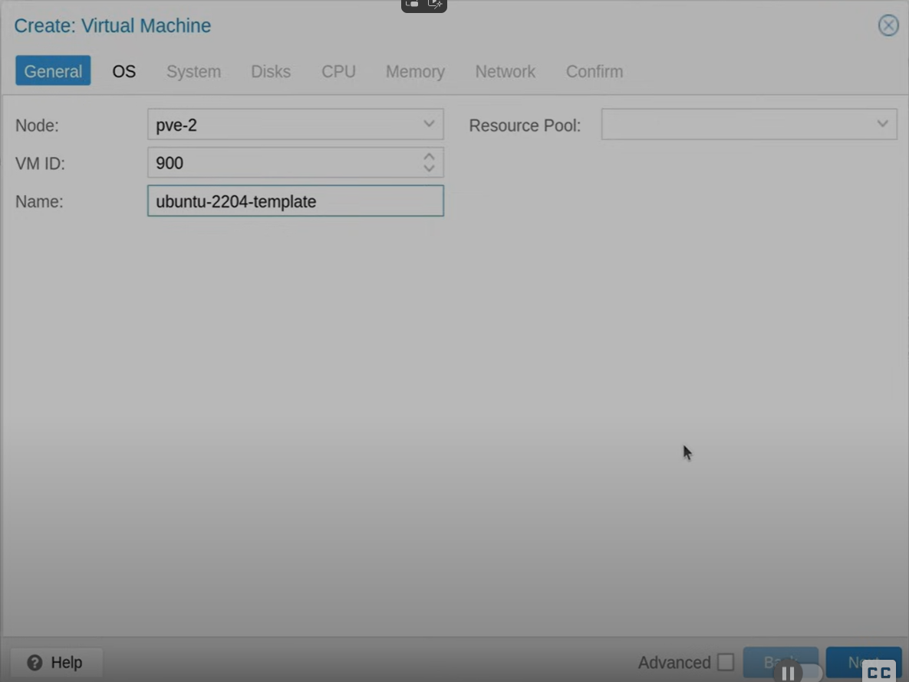
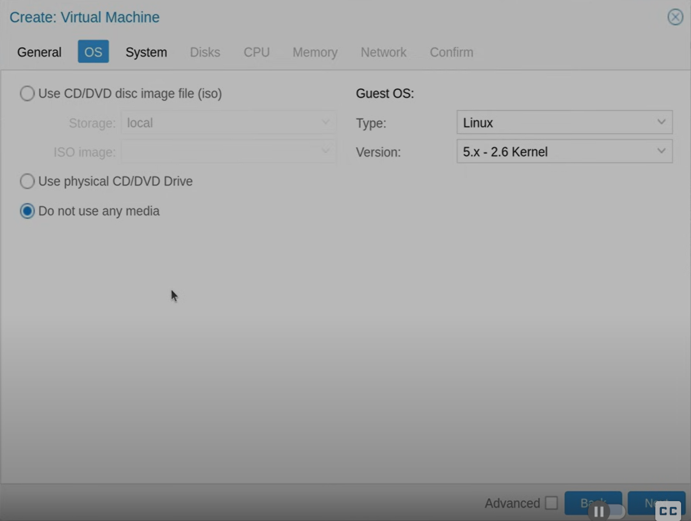
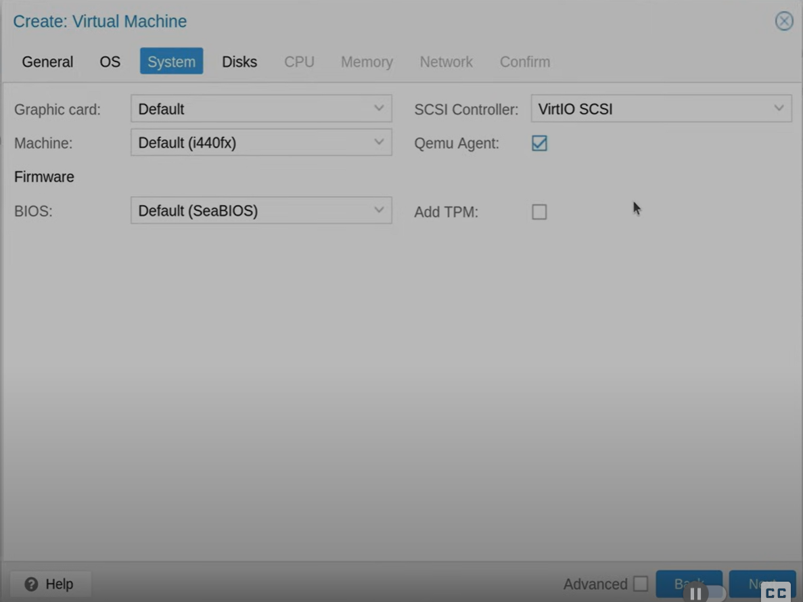
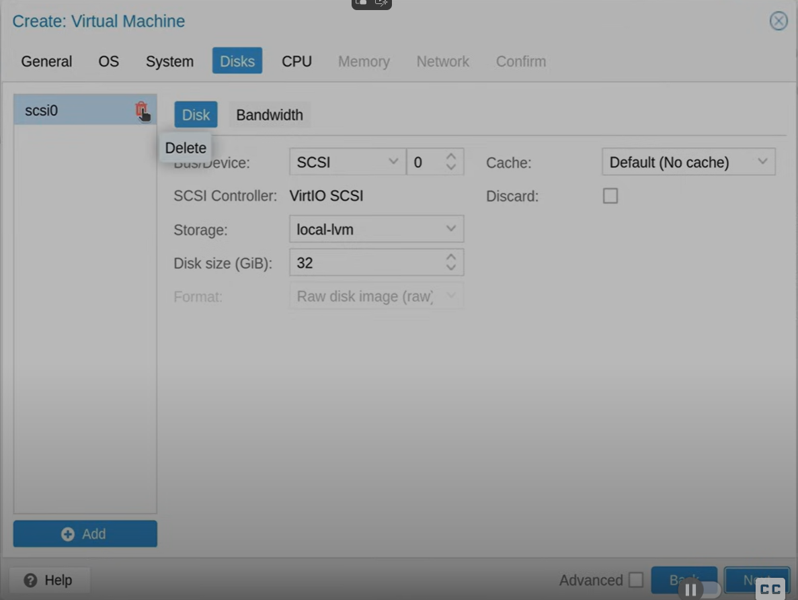
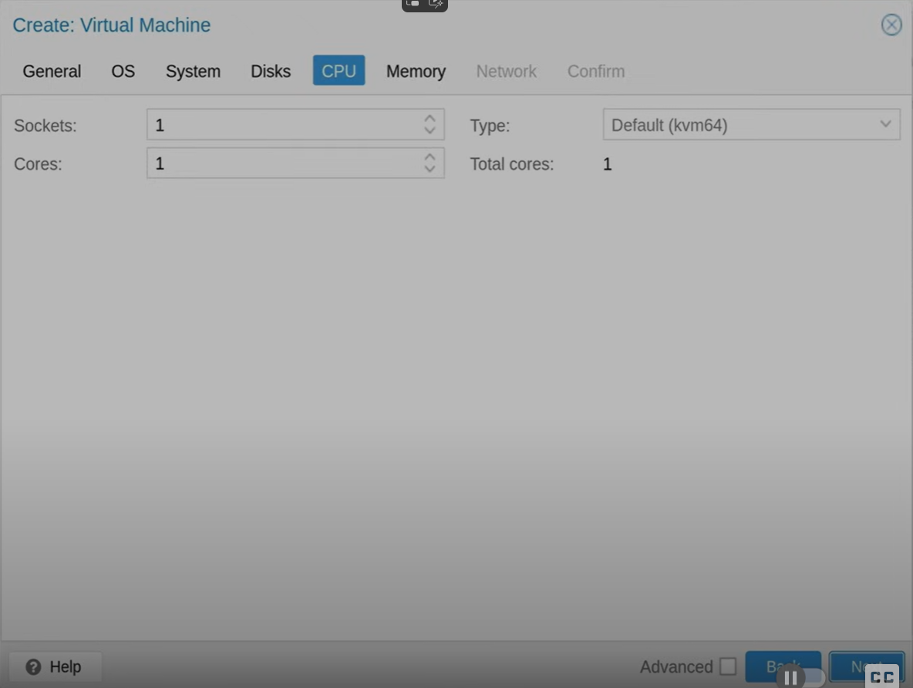
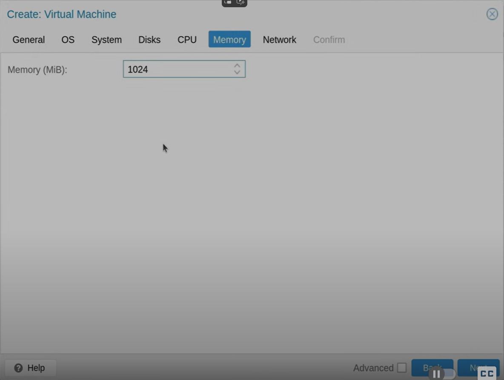
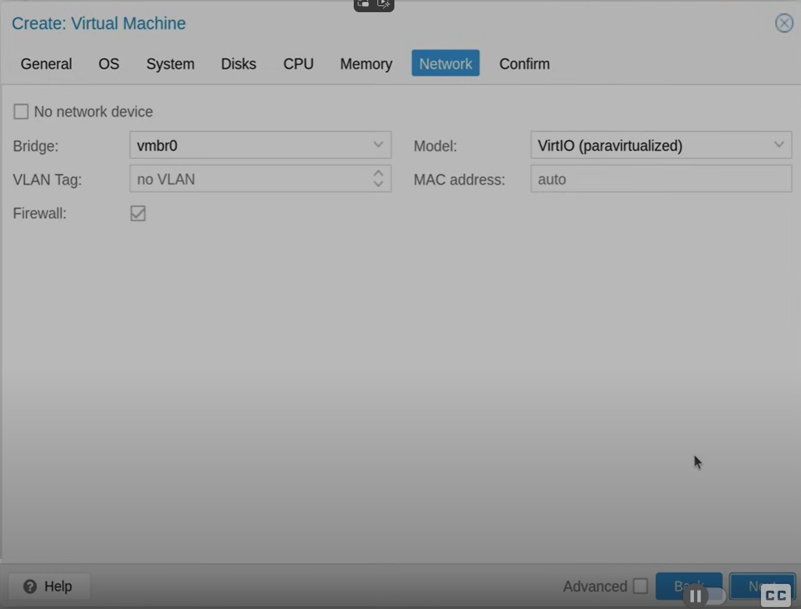
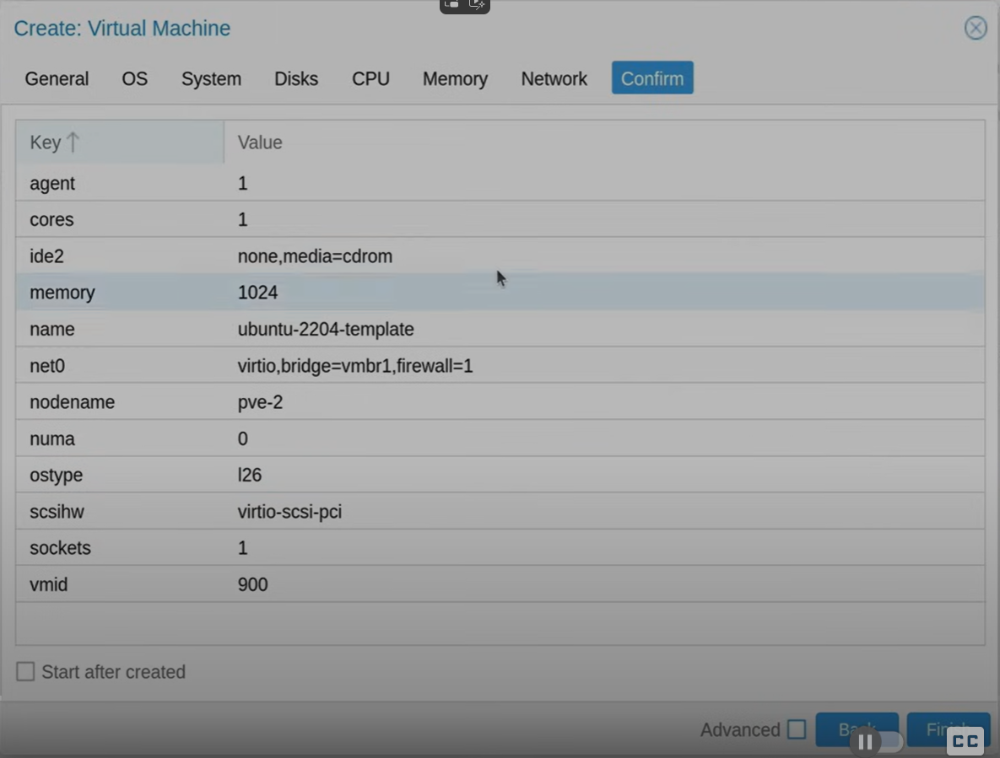

# proxmox-memo

## Create template (with cloud init image)

Ref: https://www.youtube.com/watch?v=MJgIm03Jxdo

This sample create Ubuntu 22.04

- Create virtual machine

    - General Tab
    
        - VM ID = 900
        - Name = \<something\>-template

    - OS Tab
    
        - Check = Do not use any media
    
    - System Tab
    
        - Check = Qemu Agent
    
    - Disks Tab
    
    
        - Delete disk

    - CPU Tab
    

    - Memory Tab
    
        - Memory (MiB) = 1024

    - Network Tab
    

    - Confirm Tab
    

