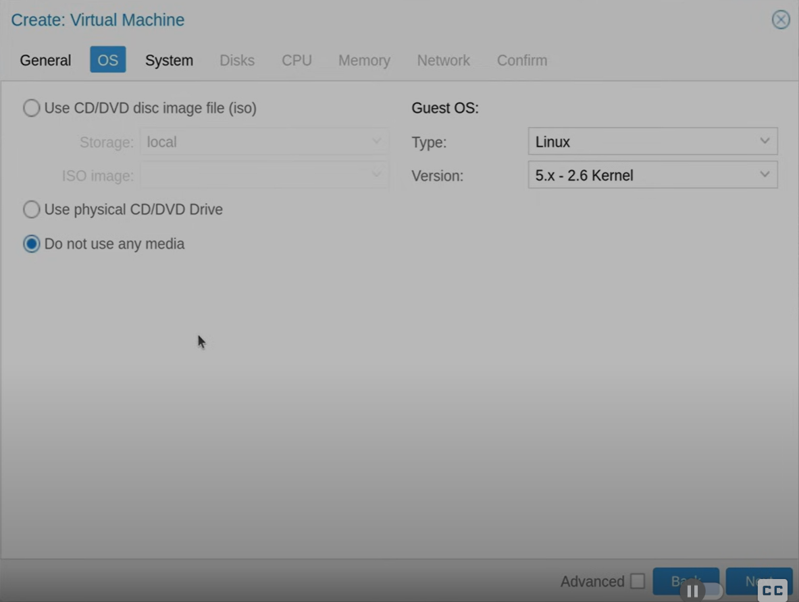
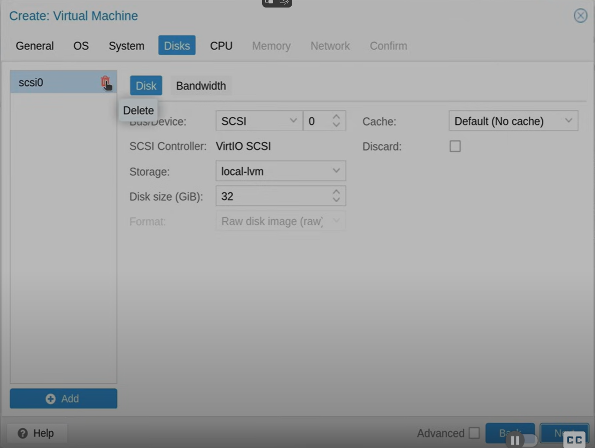
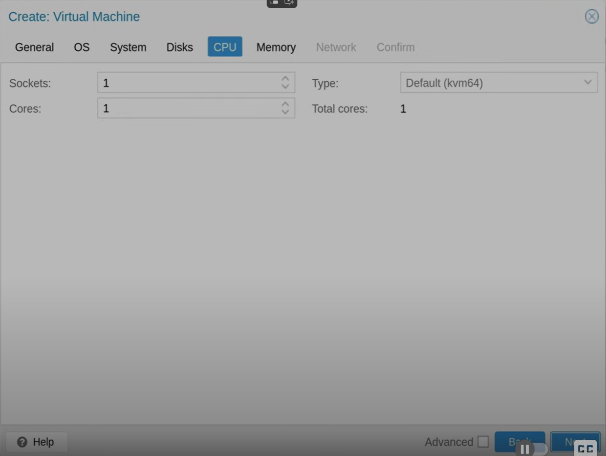
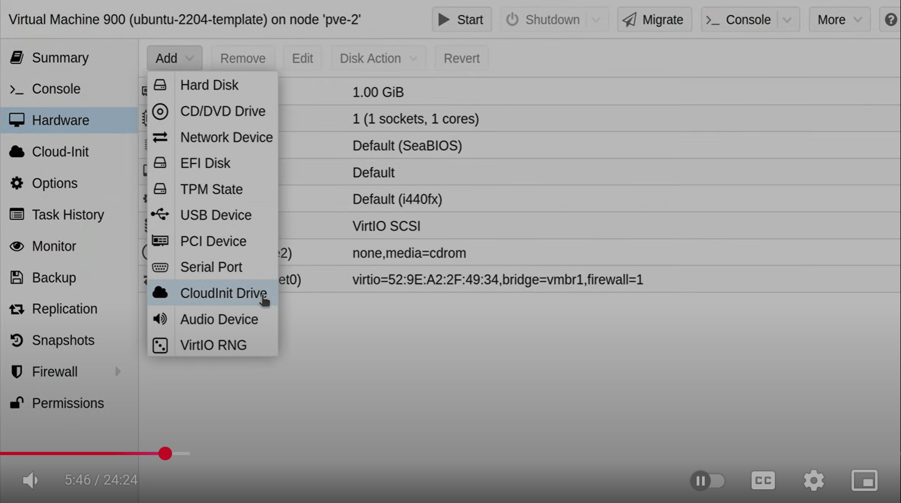
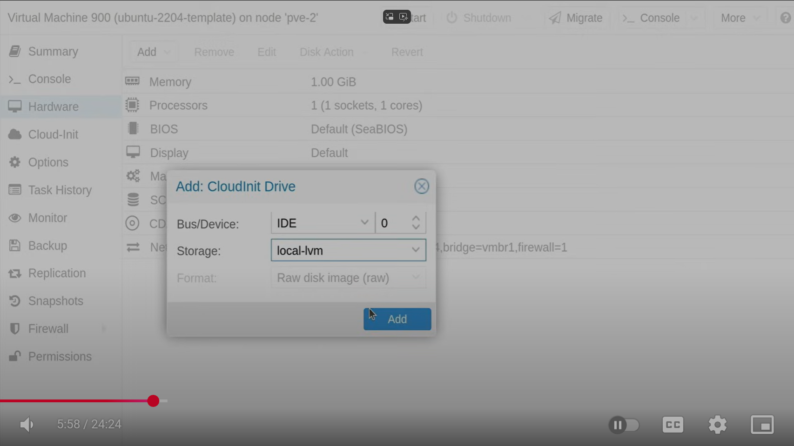
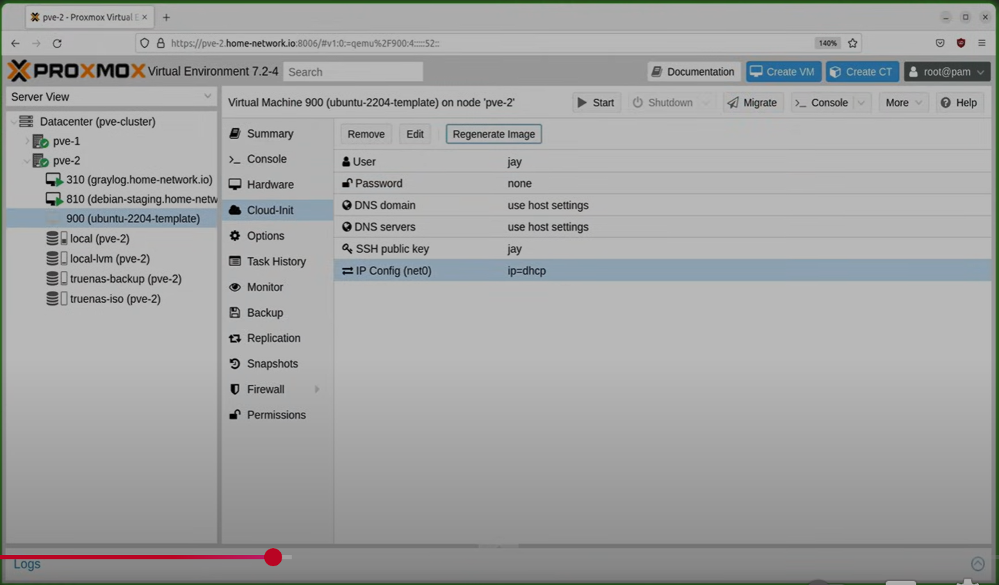

## Create template (with cloud init image)

Ref: https://www.youtube.com/watch?v=MJgIm03Jxdo

This sample create Ubuntu 22.04

- Create virtual machine

    - General Tab
    <kbd></kbd>
        - VM ID = 900
        - Name = \<something\>-template

    - OS Tab
    <kbd></kbd>
        - Check = Do not use any media
    
    - System Tab
    <kbd>|</kbd>
        - Check = Qemu Agent
    
    - Disks Tab
    <kbd></kbd>
    <kbd></kbd>
        - Delete disk

    - CPU Tab
    <kbd></kbd>

    - Memory Tab
    <kbd></kbd>
        - Memory (MiB) = 1024

    - Network Tab
    <kbd></kbd>

    - Confirm Tab
    <kbd></kbd>

- Add cloud init to VM

    - Select Template VM > Hardware
    <kbd></kbd>

    - Add > CloudInit Drive
    <kbd></kbd>

    - Storage = local-lvm
    <kbd></kbd>

- CloudInit setting

    - Cloud-Init 
        - user = \<username\>
        - password = \<password\>
        - network > DHCP
        - SSH public key = \<copy paste\>
        <kbd></kbd>

- Proxmox console

    ```
    # wget https://cloud-images.ubuntu.com/minimal/releases/jammy/release/ubuntu-22.04-minimal-cloudimg-amd64.img
    ```
    Ref: https://cloud-images.ubuntu.com/minimal/releases/jammy/release/

    ```
    # qm set 900 --serial0 socket --vga serial0
    ```
    900 is proxmox template VM id 

    ```
    # mv ubuntu-22.04-minimal-clouding-amd64.img ubuntu-22.04.qcow2
    # qemu-img resize ubuntu-22.04.qcow2 32G
    # qm importdisk 900 ubuntu-22.04.qcow2 local-lvm
    ```

- Set template

    - Select template VM > Hardware > Unused Disk 0 > Edit > Check = Discard > Check = Advanced > Check = SSD emulation > Add
    <kbd></kbd>
    <kbd></kbd>
    <kbd></kbd>

    - Option > Boot Order
    <kbd></kbd>
    <kbd></kbd>

    - Start at boot = yes
    <kbd></kbd>

- Convert to template

    <kbd></kbd>

- Create VM from template (test)

    - Clone
    <kbd></kbd>

    - 
        - VM ID = 799
        - Mode = Full Clone
        - Name = ubuntu-test
    <kbd></kbd>

    - Console
    <kbd></kbd>
    